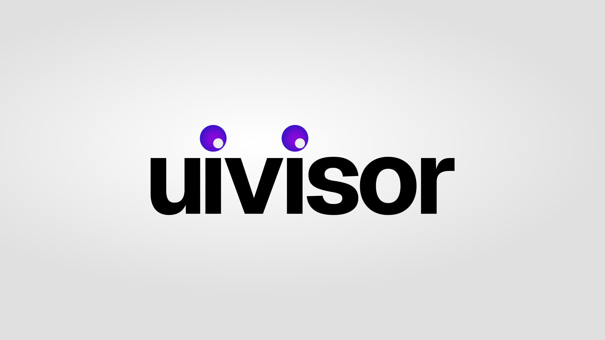

<div align="center">



<h3>Тыкни мышкой в любой элемент живого приложения, поправь его руками —<br/>и забери точный промпт для ИИ-агента с <code>file:line:col</code>. Твой код не трогается.</h3>

<p>
  
  
  
  
  
</p>

</div>

---

## Знакомая боль

Заметил в работающем приложении мелочь: тут `padding` жмёт, заголовку нужен шрифт пожирнее, карточкам не хватает радиуса на `lg`. Два плохих варианта:

1. **Лезть в код руками** ради правки в одну строку, или
2. **Жечь токены агента**, объясняя словами — *«на странице прайсинга, у средней карточки, та кнопка…»* — и надеяться, что он найдёт нужный элемент.

**uivisor — это третий вариант.** Включаешь, **кликаешь элемент, крутишь его мышкой** — и получаешь готовую инструкцию: **точный файл и строка**, **механизм стилей**, **брейкпоинт** и **что именно поменять**. Агент правит с первого раза. Сам uivisor **в исходники не пишет** — твои правки живут одноразовыми inline-оверрайдами в браузере и исчезают на перезагрузке.

Больше никакого *«страница 55, вон та штука»*.

## Что на выходе

Кликнул кнопку, добавил `padding` и поменял цвет, нажал **Copy prompt for agent** — в буфере:

```md
# uivisor — apply these UI tweaks (2 changes across 1 element)

## 1. <button> "Get started" — src/components/PricingCard.tsx:26:7
- Identify by: component <PricingCard>, data-testid="buy-pro", selector `button[data-testid="buy-pro"]`
- Styling: tailwind (current classes: `mt-6 w-full rounded-md px-4 py-2 bg-indigo-600 text-white`)
- At lg breakpoint (≥1024px):
    - padding: 16px → 24px  → `lg:p-6`
    - background-color: rgb(79,70,229) → #16a34a  → `lg:bg-[#16a34a]`

### Rules
- Edit the EXISTING className/styles. Do NOT add inline styles or duplicate the component.
- Scope each change to its breakpoint with a responsive variant (e.g. `lg:`).
```

Вставил в Claude Code / Cursor — готово. Промпт на английском нарочно: агенты понимают его одинаково чётко.

---

## Установка

```bash
npm i -D uivisor
```

> uivisor работает **только в dev** и **физически отсутствует в проде** — он подключается через дев-плагин и в продакшн-сборку не попадает.

### Vite + React

```ts
// vite.config.ts
import { defineConfig } from 'vite'
import uivisor from 'uivisor/vite'
import react from '@vitejs/plugin-react'

export default defineConfig({
  plugins: [uivisor(), react()], //  ⚠️  uivisor() ПЕРЕД react()
})
```

Запусти dev-сервер и жми **`Alt`+`U`** (или **◎** справа снизу).

### Next.js (App Router, Next 13–16)

**1. Оберни конфиг.** Работает и с `next.config.ts` / `.mjs` (ESM), и с `.js` (CJS):

```ts
// next.config.ts
import { withUivisor } from 'uivisor/next'

const nextConfig = { reactStrictMode: true }

export default withUivisor(nextConfig)
```

**2. Смонтируй оверлей** один раз в корневом layout:

```tsx
// app/layout.tsx
import { UivisorOverlay } from 'uivisor/next/overlay'

export default function RootLayout({ children }) {
  return <html><body>{children}<UivisorOverlay /></body></html>
}
```

**3. Запусти `next dev`** и жми **`Alt`+`U`**. Работает и под webpack, и под **Turbopack**:

| Команда | Оверлей | Точный `file:line` |
|---|---|---|
| `next dev` (**Turbopack**, по умолчанию в Next 15/16) | ✅ | ✅ |
| `next dev --webpack` | ✅ | ✅ |

> Под Turbopack source-locations подключаются автоматически через `turbopack.rules`. Если где-то мешает —
> отключи: `withUivisor(config, { turbopack: false })` (оверлей продолжит работать, для `file:line` тогда
> используй `next dev --webpack`). Всё это — **только dev**, в прод не уезжает.

---

## Как пользоваться панелью

1. **`Alt`+`U`** включает uivisor · **Esc** снимает выделение.
2. **Кликни любой элемент.** Откроется инспектор в духе Figma с его spacing / border / typography / fill —
   причём только релевантные контролы (Typography — на текстовых элементах, Gap — на flex/grid-контейнерах).
3. **Правь:**
   - **Текущие стили подтягиваются** — существующие значения горят белым, твои правки — зелёным. Не гадаешь.
   - **Одно поле на все стороны** — Padding / Margin / Radius по умолчанию меняют все 4 сразу; кнопка **▦**
     разворачивает на отдельные стороны/углы.
   - **Тяни-меняй** — навёл на иконку слева от числа (курсор → ↔) и тянешь — значение меняется вживую.
   - **Единицы** — у line-height и letter-spacing есть переключатель px / % / em / × и всегда видно число.
4. **Screen / breakpoint** — кликаешь `md` / `lg` / … и приложение грузится в **виртуальный экран этой ширины**
   (реальные медиа-запросы перестраиваются); тянешь край рамки для точной подгонки. Показываются **только
   брейкпоинты твоего проекта**. Правки скоупятся под выбранный брейкпоинт (`lg:p-6`). `Live` = твоё реальное окно.
5. **Apply changes to** — куда применить правку:
   - **All N like this** — если элемент повторяется (тот же компонент/исходник, напр. 3 карточки), правка
     превьюится на **всех**, а промпт просит агента поправить общий компонент/класс — без хрупкого `nth-of-type`.
   - **Only this one** · существующий **`.class`** · или **новый класс с твоим именем** (агент создаст его, старые не тронет).
6. **Copy prompt for agent** (или **Copy JSON** для машиночитаемого спека).

На диск ничего не пишется — правки живут в браузере и исчезают на reload.

---

## Твоему ИИ-агенту

Промпт от uivisor — **самодостаточная инструкция**, её можно выполнять без лишнего контекста. Получив её:

- **Иди по `file:line:col`** — это главный якорь (инжектится в dev, безопасно для React 19).
- **Правь существующий механизм стилей**, который он назвал (`tailwind` / `css-modules` / `styled-components` /
  `inline` / `plain-css`) — не inline-стили, и не плоди дубликат компонента.
- **Уважай брейкпоинт-скоуп** — отдавай responsive-вариант (`lg:…`), не делай правку глобальной.
- **Уважай таргет** — `All N like this` значит править общий компонент/класс, чтобы обновились все инстансы;
  `new class` — создать его и не трогать существующие; позиционный `nth-of-type` — крайний способ найти, а не то,
  на что вешать правку.

---

## Как это устроено

- **Source mapping** — крошечный dev-only Babel/loader-проход вешает на host-JSX `data-uiv-src="file:line:col"`
  (Vite — плагином `enforce: 'pre'`; Next — webpack pre-loader'ом и `turbopack.rules`, сохраняя SWC).
- **Идентичность слоями** — file:line → имя компонента (из файла) → `data-testid` / id / стабильный селектор / текст.
- **Механизм + токены** — определяет, чем стилизован элемент, и маппит px в Tailwind-токены
  (`24px → p-6`, `leading-normal`, `tracking-tight`), с фолбэком на arbitrary-значения.
- **Брейкпоинты** — детектятся из `@media`-правил твоего CSS, поэтому в баре — *твои* брейкпоинты.
- **Responsive-превью** — приложение грузится в ресайзимый iframe, медиа-запросы перестраиваются по-настоящему,
  а инспектор работает внутри.

## Ограничения

- **Только dev-сборки** — прод вырезает source-инфо и минифицирует классы.
- **Сначала React** — ядро (DOM/CSS/брейкпоинты) фреймворк-агностично; пока только source mapping завязан на React.
- **Заточено под Tailwind** — на не-Tailwind стеках промпт даёт сырые px + указание, какое CSS-module/styled-правило править.

## Разработка

```bash
npm install
npm run build        # tsup → dist/{vite,babel,overlay,next}
npm test             # vitest (чистая логика + babel-трансформ)
npm run demo         # Vite + React песочница на :5180
# demo-next/         # Next.js (app router) песочница на :5181
```

<div align="center"><sub>MIT · только dev · только промпт</sub></div>
